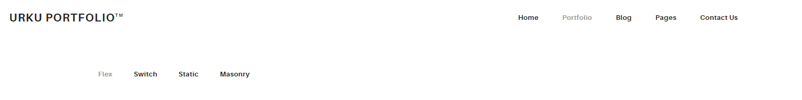
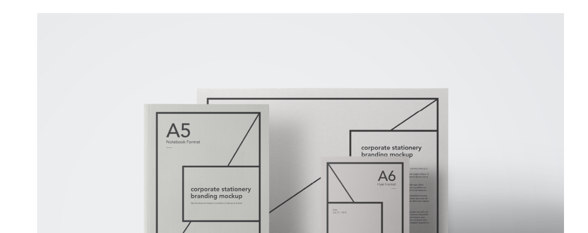
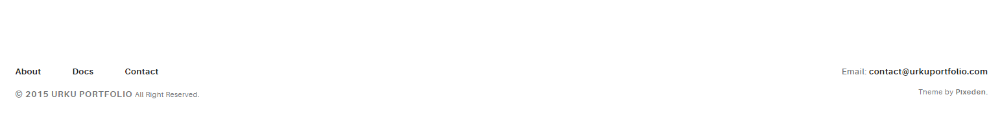
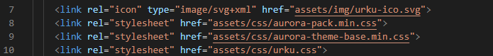
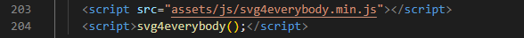

# Angular-From_HTML_Template_to_WebApp
Based in Udemy course to lear how transform a HTML template to WebApp in Angular

# 1. Introducción
## 1.1 Herramientas Necesarias
- Navegador Google Chrome para testear (https://www.google.com/intl/es_es/chrome/). Descargar e instalar.
- Node JS para cargar paquetes, ejecutar comandos de Angular, etc. La versión recomendable (https://nodejs.org/en). Descargar e instalar.
- Angular CLI, interfaz de linea de comnandos para algunar. En una terminal ejecutar "npm install -g @angular/cli"
- (Opcional) Git, para el control de versiones de código. Descargar e instalar. Y GitTortoise como interfaz de Git.
- (Opcional) Visual Studio Code (VSC), el IDE de Microsoft para desarrollar. Descargar e instalar. Este IDE soporta multitud de extensiones útiles que se pueden encontrar en /docs/extensiones-vsc.pdf. Las extensiones se instalan desde el mismo VSC pulsando en el menú lateral o Ctrl+Shift+X

# 2 Estructuras HTML a componentes Angular
- Descargar el portfolio que servirá de base para la apliación. De la web o de los rescursos del curso (sección 2.7 / 2.8)
- Copiarlo dentro de la carpeta de trabajo
- Crear una carpeta docs donde almacenar los documentos (recursos del curso)
  
## 2.1 Iniciar proyecto Angular
- Con la instrucción "ng new portafolio" se crea un nuevo proyecto llamado portafolio
- Para levantar la aplicación "ng serve -o", este comando debe ejecutarse dentro del proyecto Angular (carpeta portafolio)

## 2.2 Estructura HTML basica en el proyecto Angular
- Dentro del proyecto "portafolio" en src > assets ya se crea una carpeta donde poder almacenar el contenido estático. Aquí se debe copiar los assets de la template descargada
- Abriendo al fichero index.html de la carpeta HTML de la template y pulsando en la opción Portfolio se puede ver la estrucutra de la página y analizando determinar los componentes de la WebApp. En este caso un **header**, un **body** y un **footer**. Tres componentes en total.
  
  
  
- Abriendo el código del index.html de la template se pueden ver todas las referencias a la carpeta assets (los elmenots link). Estos se deben copiar al index.html de la aplicación Angular.
  
- En la parte inferior del index.html de la template hay dos bloques de script, encargados de ejecutar lógica en la web. La acción a tomar es la misma que con los links, conpiar estos bloques y pegarlos también al final del index.html de la aplicación Angular.
  

  ## 2.3 Componente Header
