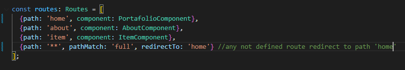
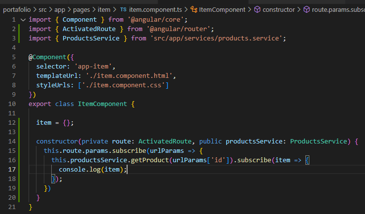

# Angular-From_HTML_Template_to_WebApp
Based in Udemy course to lear how transform a HTML template to WebApp in Angular
It is based in a [Udemy](https://www.udemy.com/) course.

 **Status: Completed** 

 
[Angular: Convierte cualquier template HTML en una WebAPP](https://www.udemy.com/course/html-hacia-angular/) by Fernando Herrera.

# 1. Introducción
## 1.1 Herramientas Necesarias
- Navegador Google Chrome para testear (https://www.google.com/intl/es_es/chrome/). Descargar e instalar.
- Node JS para cargar paquetes, ejecutar comandos de Angular, etc. La versión recomendable (https://nodejs.org/en). Descargar e instalar.
- Angular CLI, interfaz de linea de comnandos para algunar. En una terminal ejecutar "npm install -g @angular/cli"
- (Opcional) Git, para el control de versiones de código. Descargar e instalar. Y GitTortoise como interfaz de Git.
- (Opcional) Visual Studio Code (VSC), el IDE de Microsoft para desarrollar. Descargar e instalar. Este IDE soporta multitud de extensiones útiles que se pueden encontrar en /docs/extensiones-vsc.pdf. Las extensiones se instalan desde el mismo VSC pulsando en el menú lateral o Ctrl+Shift+X

## 1.2 Visual Studio Code extensions:
- 

## 1.3 Comandos utiles:
- Version de Node: node -v
- Versión de NPM: npm -version
- Instalar Angular: npm install -g @angular/cli
- Versión de Angular: ng version
- Creación de proyecto angular: ng new nombreApp
- Arrancar aplicación: ng serve -o (-o para abrirlo automaticamente)
- Crear un componente: ng g c nombreComponente
- Ayuda en creación de componentes: ng g c --help

# 2 Estructuras HTML a componentes Angular
- Descargar el portfolio que servirá de base para la apliación. De la web o de los rescursos del curso (sección 2.7 / 2.8)
- Copiarlo dentro de la carpeta de trabajo
- Crear una carpeta docs donde almacenar los documentos (recursos del curso)
  
## 2.1 Iniciar proyecto Angular
- Con la instrucción "**ng new** portafolio" se crea un nuevo proyecto llamado portafolio. Crea además el componente principal de la aplicación **app.component**.
- Para levantar la aplicación "**ng serve -o**", este comando debe ejecutarse dentro del proyecto Angular (carpeta portafolio)

## 2.2 Estructura HTML basica en el proyecto Angular
- Dentro del proyecto "portafolio" en src > assets ya se crea una carpeta donde poder almacenar el contenido estático. Aquí se debe copiar los assets de la template descargada
- Abriendo al fichero index.html de la carpeta HTML de la template y pulsando en la opción Portfolio se puede ver la estrucutra de la página y analizando determinar los componentes de la WebApp. En este caso un **header**, un **body** y un **footer**. Tres componentes en total.
  
  
  
- Abriendo el código del index.html de la template se pueden ver todas las referencias a la carpeta assets (los elmenots link). Estos se deben copiar al index.html de la aplicación Angular.
  
- En la parte inferior del index.html de la template hay dos bloques de script, encargados de ejecutar lógica en la web. La acción a tomar es la misma que con los links, conpiar estos bloques y pegarlos también al final del index.html de la aplicación Angular.
  

  ## 2.3 Componente Header
- Como estructura de página el fichero "portfolio-masonry.html" parece el más actrativo y es el que se elegirá para crear los componentes
- Los recursos compartidos dentro de la misma aplicación los podemos almacenar creando una carpeta "shared" dentro de "src > app"
- Para crear el componente "ng g c shared/header --spec=false", la ultima parte es para indicar que no se cree el fichero de pruebas unitarias, pero este argumento ha sido cambiado en version es de Angular posteriores al curso, ahora hay que usar "--skip-tests", por lo que el comando queda "ng g c shared/header --skip-tes
  
  
- Este componente es el encargado del header, por lo que, desde "portfolio-masonry.html" se copia el header y se lleva al html del componente.
  
- El componente creado tiene el selector **app-header**, por lo que se puede utilizar en el componente principal de la aplicación "app.component.html". Y esto se puede ver en el resultado final en el navegador.  
  
  
- Siempre que se crea un componente este es añadido al módulo de la aplicación app.module.ts, es buena práctica verificarlo.
  

  ## 2.4 Componente Footer
  - Al igual que se ha hecho para crear el componente header, se tiene que hacer para crear el componente footer.
  - Se debe tomar el footer del "portfolio-masonry.html" para el nuevo componente footer.
  - Se debe crear igual que antes, en este caso "ng g c shared/footer --skip-tests"
  - El nuevo componente tiene el selector **app-footer** que se debe usar para añadirlo al componente principal de la aplicación "app.component.hmtl"
  - Tras añadirlo, el footer aparecía oculto tras el header y además lo desplazaba. Si se añaden saltos de linea entre ambos selectores se podrá ver.
  
  
  - En el footer aparece una fecha, esta está desactualizada. Se puede usar una instrucción angular para que siempre muestre la fecha actual. Para ello hay que añadir la lógica en el componente footer, en su fichero typescript (ts). Posteriormente entre llaves dobles se puede invocar la variable creada que contiene la fecha actual.
  
  

  ## 2.5 Componente Portafolio
  - Al igual que se ha hecho para crear el componente header y footer, se debe tomar el portafolio del "portfolio-masonry.html" para el nuevo componente portafolio. Se debe detectar los elementos de HTML que pertenecerían al cuerpo.
  - Se debe crear igual que antes, en este caso el portafolio no será común para todas las páginas, por lo que no se deberá crear en la carpeta shared, si no que se creará una carpeta nueva donde almacenar todas las posibles páginas a tener llamada "pages", por lo que el comanod sería "ng g c pages/portafolio --skip-tests"
  - La pagina se puede personalizar como se quiera, por ejemplo, quitar las categorías de portafolios y dejar sólo el tipo Masonry.
  - Cada componente sólo debe tener información única, y el componente creado posee un primer elemento **section** que se repite en otras páginas, por lo que se debe quitar del componente y añadir al HTML de la aplicación.
  

  ## 2.6 Componente About
  - Como se viene haciendo, tomar el HTML de la template referente al about y crear un nuevo componente. Este es tipo página por lo que tendrá que ir a la carpeta pages y se le deberá eliminar el primer elemento section/div que ya se ha añadido al HTML del componente de la aplicación (app)
  - El comando a ejectuar debe ser "ng g c pages/about --skip-tests"
  - Por ahora no existe navegación, así que si se quiere ver el resultado de la creación de esta nueva página habrá que sustituirla en el app.component.
  

  ## 2.7 Componente Item
  - Partir del portfolio-item.html y crear el componente tipo página llamado item. Se debe usar "ng g c pages/item --skip-tests"
  - Usarlo en el app.component para comprobar que se muestra correctamente
  

  # 3 Creacion de rutas
  ## 3.1 Definición de rutas
  - Se puede usar Angular CLI para crear el routing, pero en este curso la idea es crear todo desde cero (o casi todo), por lo que en este caso habrá que crear un fichero en la carpeta app llamado "app-routing.module.ts" donde se configurarán las rutas de la aplicación. Es posible que en la creación del proyecto ya se haya creado este fichero (es mi caso), ya que dependerá de la versión de Angular.
  
  - El ruteo se podría añadir al app.module.ts, donde se declaran los componentes, pero se hace por separado para que no quede tan cargado.
  - En Angular, todo son clases, y para que estas se puedan usar se deben exportar, de ahí que se use la palabra **export** antes del **class**.
  - Para crear un módulo se debe usar del decorativo **@NgModule** e importarlo de **@angular/core**.
  - Las rutas quedan almacenadas en un array constante del tipo **Routes**, que debe ser importado de **@angular/router**. En esta constante es donde se alacenará el mapa de rutas componentes de la aplicación.
  - Al ir rellenando la constante de rutas (path y component) se deberían ir añadiendo automaticamente los imports necesarios, si no, habrá que añadirlos a mano. Se puede definir que cualuqier ruta que no declarada (**) se redireccione a otra, lo ideal, a la principal, el PortafolioComponent.
  
  - En el modulo de la aplicación (app.module.ts) si no se ha hecho de manera automatica, hay que importar el modulo de rutas AppRoutingModule creado.
  
  - En este punto se puede comprobar en el navegador las rutas aceptadas y las que no, pero no se verán cambios en la web. Se comrpueba escribiendo rutas que existen, permaneceran en el navegador y las que no redireccionarán a la principal, tal y como se ha definido. Es decir:
    - Escribir /about, el navegador mantendrá la dirección aunque por ahora no se verá nada
    - Escribir /item, el navegador mantendrá la dirección aunque por ahora no se verá nada
    - Escribir /hola, el navegador cambiará la dirección a '' que es lo que se ha definido, aunque por ahora no se verá nada

  ## 3.1 Full Refresh
  - Hay que indicarle a Angular que dependiendo de la ruta, renderice un componente u otro, es decir, use lo definido en el modulo de routing (app-routing.module.ts). Para ello se usa **router-outlet** en el HTML de la aplicación. Si al usar este selector en la web aparece un error se debe a que falta exportar en el modulo de ruta el RouterModule.
  - Si ahora se cambia la ruta la web se actualizará con el contenido de los componentes además de la redirección cuando sea necesario. Esto hace un full refresh, que no es lo deseado, aunque por ahora funciona.
  

  ## 3.2 RouterLink
  - En este punto se va a editar en menú de navegación y el footer para que funcionen correctamente. Ahora mismo si se clicka en cualquier opción de la aplicación la ruta cambia para recuperar un recurso HTML, como ninguna de estas rutas está definida, siempre se redirecciona a la ruta por defecto como se indicon en el modulo de rutas.
  - El componente header es el que se encarga de pintar la cabecera, y por tanto el que se tendrá que modificar para que las opciones del mismo funcionen.
  - En su HTML contiene una sección con todos los href de los enlaces, esto en una aplicación Angular se debe cambiar para que no tenga que recargar completamente la página.
  
  - En Angular los href son susitutiidos por la directiva **routerLink** igualando la ruta deseada. Si se sustituyen los htref por las rutas de los componentes relacionados, se podrá observar como al clickar en ellos en la aplicación, la ruta va cambiando y los componentes apareciendo.
  
  - Además se ha detectado que la clase "active" es la que cambia el estilo de la opción según esté seleccionada, pero ahora no está funionando. Para ello se usará Angular también.  Para ello se usa la directiva **routerLinkActive** igualandola a la clase deseada cuando esté activa, en este caso, "active". Añadiendo esta directiva lo que hace Angular es que si la ruta coincide con la del routerLink que contiene, pondrá la clase indicada en el routerLinkActive. Haciendo esto no termina de comportarse del todo, porque la ruta about también contiene ruta vacía, por lo que coincide y se activan Home y About a la vez al marca Home, no pasa marcando Homme.
  
  - Para solventar lo anterior habrá que definir mejor el modulo de rutas. Para ello sustituiremos la ruta vacía "" por "home". También habrá que cambiarlo en el routerLink del header.
  
  
  - En el footer también hay links para sustituir por su versión en Angular, se puede cambiar también.
  - Por último sería cambiar los items, pero por ahora se hará sólo con el primero, esto está en el componente portafolio. En portafolio para configurar la llamada a item, aquí se usa "/item" ya que si no se pensaría que es una ruta hija, y en este caso es una ruta padre.
  

  ## 3.3 Hash Routing
  - Normalmente en los servidores las rutas se configuran en el archivo htaccess. La idea final de este curso es poder desplegar en GitHub Pages, donde no se tiene acceso a este archivo, por lo que no se podrá usar este tipo de rutas. El navegador pensará que tiene que buscar el directoro item, about, home, o cualquiera que se indique después del slash (/). Para solventar eso, usaremos el hash, es decir, que a la ruta se agregue un hash.
  - Para configurar el hash en las rutas es necesario modificar el app-routing.module.ts. Hay que añadir un parametro la import del RouterModule quedando:
  
  - Probando la aplicación, ahora se introduce un hash previo a la ruta, esto le indica al navegador que no intente cargar el directorio que viene después del slash (/), sino que eso es parte de la ruta.
  
  

  # 4 Servicios, constantes y HTTP
  ## 4.1 Configuración de la aplicación usando JSON
  - Para configurar cosas globales de la aplicación, como enlaces a otras aplicaciones, nombres, emails, etc, se puede usar un JSON donde almacenar todo.
  - En la carpeta assets, crear una nueva carpeta llamada data y dentro un fichero JSON llamado "data-page-json".
  - Definir dentro de el json creado algunas propiedades fijas/constantes de la aplicación. Una de las propiedades debe almacenar el equipo de trabajo, yo la he llamado "work_team", por ahora no hace falta darle valor.
  
  - Para comprobar que la estrucutra de un JSON es correcta, se puede usar la web http://json.parser.online.fr/.

  ## 4.2 Servicio para consultar los datos
  - Un servicio se puede usar para compartir información global dentro de toda la aplicación, para manejar logica, etc. Se ha de crear un servicio que permita leer el JSON de la configuración en cualquier punto de la aplicación. La idea es que la configuración se cargue una sola vez al acceder a la aplicación.
  - Para crear un servicio en Angular hay que ejecutar el comando **ng g s services/infoPage --skip-tests**. Este comando creará el servicio infoPage dentro de una nueva carpeta services y en la creación de éste, no generará un archivo para test.
  - Tras crear el servicio se puede comprobar como el app-module.ts no fue actualizado automaticamente (como cuando se crea un componente). Los servicios normalmente se deberían importar y añadir al array de providers. Pero esto ya no es necesario, ya que en la definición del servicio tiene un decorado (**@Injectable**) que indica dónde ha de inyectar el servicio, y por defecto lo hace en "root".
  
  - Ahora habría que invocar el servicio al iniciar la aplicación, es decir, en el "app.component.ts". Se debe crear un constructor y en el hacer la inyección de una dependencia. El nombre en la inyección puede ser cualquiera, pero se suele indicar como "_nombre" o "nombreService", a mi me gusta más la segunda opción.
  - Con sólo hacer la inyección, Angular llama al servicio automaticamente.
  
  
  
  - Ahora hay que implementar en el servicio la lógica necesaria para obtener la información, para ello será necesario el uso de un modulo que permita hacer llamadas http, **HttpClientModule**. Habrá que importar este módulo en el app.module.ts. Si al añadirlo a los imports no se reconoce el módulo hay que añadir la importación manualmente tal y como se indica el la siguiente imagen.
  
  - En el InfoPageService hay que inyectar un servicio ya incluido en el módulo HttpClientModule que se acaba de importar a la aplicación. Se puede usar su función **get** para obtener la información en una dirección. Además se puede añadir un par de campos propios del servicio que se está implementando (InfoPageService) para guardar información relativa a la consulta hecha. Como se desconoce la información que se va a obtener al invocar la dirección mediante get, el tipo de objecto donde se guardará se define como **any** y con un boolean podemos controlar si ya hubo o no respuesta del servicio. *Si por alguna razón, se obtiene un 404 al intentar acceder al json habiendo escrito correctamente la dirección, cambia recompila la aplicación*.
  
  

  ## 4.3 Interfaz para la información de página (DataPage)
  - Esta sección es opcional, pero aconsejable, ya que se explica cómo crear una interfaz para la respuesta obtenida en la consulta get al fichero data-page.json. De esta manera, la respuesta que se almacena en el campo info de tipo **any**, será del tipo interfaz que creemos, dotando así de identidad al objeto y conociendo sus propiedades.
  - Con el comando **ng g i interfaces/data-page interface** se crea la carpeta interfaces y dentro la interfaz DataPage. El ultim atributo "interface" es opcional, pero si no se pone, el nombre del fichero no contendrá ".interface" y por tanto habrá que cambiar el nombre a mano ya que la generación automática no lo hace (a diferencia que en los servicios). También se puede omitir, pero no respetaríamos la sintaxis que seguimos con los services.
  
  
  - Siempre está la opción de crear el fichero completamente de manera manual, al igual que con el resto de elementos de la aplicación, pero de ese modo no aprovecharíamos las ventajas de Angular CLI.
  - Ahora sólo quedaría añadir a la interfaz todo los campos del JSON, pero esto es muy tedioso. Con la extensión *JSON to TS* se puede hacer de manera automática.
  
  - En este momento dentro del servicio info-page es posible dotar de entidad a la respuesta de la llamada cambiando any por el tipo DataPage. Pero se nos marca error, ya que no se puede inicializar a objeto vacío.
  
  - La manera de solventar esto es indicarle a Angular que todas las propiedades de la intefaz son opcionales. Esto se hace añadiendo un **?** a todas las propiedaes. Además, si se especifíca que la respuesta en la llamada al get es tipo DataPage, TS reconocerá las propiedades del objeto.
  

  ## 4.4 Using InfoPageService
  - En este punto, cuando se accede a la aplicación, se inyecta el servicio y como se ha implementado, en el constructor del mismo almacena en su campo info la respuesta de la llamada a obtejer el fichero JSON. Este campo info es de tipo DataPage y se puede usar en distintas partes de la aplicación para obtener la información obtenida.
  - Los componentes footer y header se van a beneficiar de esta información, por tanto deberán importar el servicio e inyectarlo en el constructor para poder acceder a su campo info y las diferentes propiedades usando **{{}}**. También se puede poner entre **[]** el atributo que se quiere asociar a la propiedad y usar esta sin las llaves (cono en el ejemplo del footer)
  
  
  

  ## 4.5 Adding animations
  - Se agregar animaciones a los elementos de la web con css. Animate.css son un conjunto de clases que permite hacer este tipo de animaciones facilmente.
    - Fichero: https://github.com/animate-css/animate.css/blob/main/animate.css
    - Documentación: https://animate.style/
  - El fichero src > styles.css es el que contiene los estilos css de la aplicación, por ahora debería estar vacío. Aquí se deben añadir las clases que se van a utilizar (fadeIn).
   
  - Ahora se puede agregar la animación a las fotos en about, para ello, en los elementos de las imágenes, agregar a su atributo class la clase **animate__animated animate__fadeIn**. Por ejemplo al primer item de portafolio y a la primera imagen del about.
  
  

  # 5. Backend with FireBase
  Firebase es un servicio que proporciona una base de datos muy parecida a Mongo, es decir, base de datos documental. Este tipo de base guarda los objetos en tipos muy parecidos a los de JavaScript. Además de esto proporciona un backend con los servicios rest para poder consultar la base de datos.
  ## 5.1 Data Base creation with Firebase
  - La idea de este punto es almacenar la información de los componentes del equipo (la información de about) en una base de datos y mediante un servicio rest que provea Firebase acceder a esta información.
  - Acceder a Firebase en https://firebase.google.com/, para ello se debe estar registrado. Pulsar el "Go to console" y pulsar en la tarjeat "Agregar proyecto"
  
  - Ahora hay que ir rellenando la información necesaria, como nombre de proyecto (angular-from-html-to-webapp), país y aceptar las condiciones. Yo he dejado Google Analytics activo ya que es gratuito y en un futuro podría aportar información relevante. Finalizar pulsando en "Crear proyecto". Tarda menos de un minuto en crearse el proyecto.
  
  
  
  - Pulsar en el menú lateral "Todos los productos", se podrá ver todo lo que proporciona Firebasse. Una de las opciones es Realtime Database, pulsar en ella.
  
  
  
  - Pulsar en "Crear una base de datos", elegir la ubicación más cercana a su localización para la base de datos, en reglas de seguridad elegir "modo de prueba" y pulsar "Habilitar". Una vez creada, acceder al tab "Reglas" y en read escribir true en write escribir false, para ser nosotros los únicos que pueden escribir. Después pulsar "Ctrl+s" o pulsar "Publicar".
  
  - En la pestaña "Datos" es donde se gestionan los datos de la base de datos. Poniendo el icono sobre la dirección aparece un + que sirve para añdir la información. Como lo que se quiere es añadir la información en about, hay que ir añadiendo filas hasta que quede como en la siguiente imagen.
  
  - La primera fila representa el campo "team", la siguitente el primer miembro "0" y las que cuelgan de este, son los diferentes campso para cada miembro como puede ser message, name, subtitle, twitter. Después de ello pulsar agregar. Lo siguiente sería crear una entrada por cada componente del about.
  - Clicando sobre "work_team" la url cambia, si se pulsa sobre el icono del "lik", el que está a la izquierda de la url, se copiará al porta papeles. En mi caso https://angular-from-html-to-webapp-default-rtdb.europe-west1.firebasedatabase.app/work_team. Si en el navegador se pega esta dirección concatenado de **.json**, se estará invocando al servicio REST que devuelve el JSON del objeto ("tabla") "work_team" que se acaba de crear. En total sería la dirección **https://angular-from-html-to-webapp-default-rtdb.europe-west1.firebasedatabase.app/work_team.json**
  
  
  - Lo que quedaría por añadir son las imagenes (fotos) de cada persona que aparece en el about. Estas las podemos almacenar en el "Storage" de Firebase. Pulsar en el menú de la izquierda "Storage", después "Comenzar" y una vez creado el la pestaña "Reglas" modificarla para que todo el mundo pueda leer, quedando:
  
  - Desde la pestaña de "Archivos", seleccionar "Subir archivo". Seleccionar de dentro del proyecto de la aplicación "assets > img", los fichero team-1.jpg, team-2.jpg y team-3.jpg.
  
  - Seleccionando la primera imagen, después en la parte inferior derecha, clicakndo sobre el hash bajo "Token de acceso" se copiará al porta papeles la dirección de la imagen. Si se pega en el navegador se podrá ver.
  
  - Ahora, habrá que copiar esta dirección y almacenarla en cada elemento del objeto "work_team" creado previamente. El campo que almacenará esta dirección se llamará "url".
  

  ## 5.2 Using Firebase REST service to get work_team information
  - Si se recuerda, anteriormente el servicio InfoPageService obtenia de un json almacenado en el proyecto información de la web, pero se dejó sin informar el campo "work_team". En este punto, lo que se hará es una llamada al servicio REST de Firebase que expone el objeto "work_team" creado en el punto anterior para obtener la información.
  - En el servicio InfoPageService, agregar una llamada get para obtenerla información y guardarla en el campo info.work_team. En la siguiente imagen se muestra como se ha hecho junto con una pequeña estructuración del fichero "info-page-service-ts". Tras el cambio y recarga de la aplicación, se podrá ver en los logs que se obtienen los datos incluidos en Firebase.
  
  
  - Ya con la información se podría crear un interfaz al igual que antes para dotar de identidad al objeto obtenido en la llamada (también se puede usar sin interfaz). Y así, con mayor fiabilidad usar los campos en el HTML del componente about para mostrar la información, aunque previamente hay que inyectar el servicio en el componente about.
  
  - Ahora en el HTML podemos añadir la información. Este es buen momento para usar las ventajas de Angular. Como se requiere mostrar 3 "tarjetas" (div) de los componetnes del equipo (Work_team), se puede usar la instrucción / directiva ***ngFor="let person of infoPageService.team"** en una sola tarjeta (div) e iterar a lo largo del array team. Esta instrucción lo que hace es repetir el div por cada elemento de team, y en cada iteración lo guarda en la variable person, por lo que usando esta variables se puede acceder a la infromaciónd e cada componetne del quipo. Como se puede ver en la siguiente imagen, ahora sólo hay un div que se repetirá tantas veces como componentes / miembros del equipo y se usa la variable person para acceder a la información.
  
  

  # 5.3 Exporting and importing information to Firebase
  - La idea es cargar toda la información de la web de manera dinámica. En el recurso adjunto de la clase del curso está la información necesaria.
  - Previamente a añadir la información, se debe hacer una backup de la base de datos creada. Para ello, en los tres puntos a la derecha de la dirección de la base de datos en Firebase Realtime, pulsar "Exportar JSON". Esto exporta el JSON con la información añadida hasta ahora que debería ser sólo el objeto "work_team".
  
  - Es posbile importar JSON en la base de datos y así se crearán los objetos necesarios. Para ello, de los recursos del curso, obtener productos.json y productos_idx.json. Previo a ello hay que crear un nodo temporal para productos, esto se hace clicando en la url o en el lapíz que aparece a su derecha en Firebase y editandola concatenando "productos" al final. Es en esta url donde se debe clickar en los tres puntos e "Importar JSON" para importar el productos.json.
  
  
  - Repetir lo mismo para crear el objeto productos_idx. Una vez hecho esto, clickando en la url de la base de datos se puede observar la estructura con los nuevos objetos.
  

  ## 5.4 Creating ProductsService and building items
  - En esta sección se va a crear un servicio para obtener los productos y poder así construir la parte del home de la aplicación (componente portfolio)
  - Usando el comando **ng g s services/products --skip-tests** se creará el servicio. Nótese que no hace falta añadir al comando el atributo service para que Angular le concatene la palabra Service al mismo.
  - En el constructor se inyecta la clase HttClient ya que se necesitará para hacer peticiones a Firebase. Además se añadirá un flag "loading" que indicará si se está cargando la información desde el servicio o no, éste será utilizado en el futuro.  
  - Como buena práctica hay que crear una interfaz para la respuesta de este servicio. El comando sería **ng g i interfaces/products interface**, se puede tomar de la consola del navegador el JSON de la respuesta y usando la extensión "JSON to TS" implementar el products.component.
  
  

  - Dónde llamar a este servicio depende de cada uno. En este caso, se puede hacer an al app.component o en el portafolio.component. Pero lo optimo es hacerlo en el app.component, ya que aquí sólo se llamará una sóla vez al acceder a la web. Si se pone en el portfolio.component, cada vez que se acceda a home de la web se llamará al servicio. A priori, la información sobre productos no cambia mientras navegamos por lo que lo ideal es hacerlo al cargar la web.
  
  - Antes de empezar a usar la información obtenida hay que arreglar un error en el campo url de los elementos del objeto productos_idx en Firebase. En los campos url que contengan ".jpg" se deberá elimnar esta extensión, dejando sólo el nombre del fichero. Después de modificar el campo url, se puede verificar en el log del navegador que ahora responde sin ".jpg".
  
  
  - El servicio lo vamos a usar el el componente portfolio, por lo que deberemos inyectarlo también aquí (portafolio.component.ts) para poder recuperar la información y pintarla en su HTML (portafolio.component.html). Este HTML va a quedar mucho más simple ya que todos los items se recuperan del servicio y con la misma directiva / instucción que se usó en el about se puede iterar en el array de productos, ***ngFor="let item of products"**.
  - Hay que tener en cuenta que las imagenes de los productos están en los recursos proporcionados en el curso anteriormente, en la carpeta "productos" del último zip del curso, por lo que habrá que copiarla y pegarla en la carpeta "assets" del proyecto para poder acceder a ellos.
  
  
  
  - Quedaría pendiente que al seleccionar un item, aparezca la información del mismo, lo cual no está pasando ahora mismo. Para ello habrá que enviar el id del item para así poder recuperarlo en el componente item.

## 5.5 Adding loading overlay
- En este punto se va a añadir un overlay de carga para usar en el portafolio. El código del overlay se puede descargar de https://codepen.io/Klerith/pen/RZpwKm. La idea es que mientras Firebase responde a las peticiones el overlay indique al usuario que la web se está cargando (aunque Firebase responda rápido, es buena práctica).
- Se debe copiar el código HTML del overlay y pegarlo en el HTML del portafolio.component, juesto después de las section y antes de la div que contiene los items. Se pondrá dentro de otro div con alineación center para mejorar el aspecto, además de añadir un párrafo.
- Se debe copiar el código CSS y pegarlo en el fichero styles.css de la aplicación.
  
  
- Si se mira el resultado en la web, se puede ver el spin girando. Ahora habrá que indicarle a la apliación cuando mostrarlo y cuando no. Usaremos el campo "loading" del ProdcutService. De tal manera que si la variable es true se mostrará el div del overlay y se ocultará el div del contenido de los items y al contrario. El servicio responde, muy rápido, por lo que **para testearlo** se puede poner un timeout que retarde el cambio de valor de variable en el ProductsService. Una vez testeado, revertir estos cambios.
  
  

  # 6. Items and search feature
  ## 6.1 Sending params by URL
  - Acutalmente en el portafolio el routerLink de cada item está hardcode a "/item" en el "portafolio.component.html", cuando debería variar dependiendo del item. Para arreglar esto hay que modificar las rutas en el "app-routing.module.ts", en la ruta del item hay que cambiarlo por "/item/:id". Esto indica que en la URL aparecerá el id del item.
  
  - Ahora hay que especificar el id de cada item. Esto se hace modificando el routerLink de cada item en el "portafolio.component.html". El id será el campo "cod" de cada item, que es el que coincide con lo elemntos de la tabla productos en Firebase (no la de productos_idx). Para indicar a Angular que en un atributo de un elemento va a recibir parametros de forma dinámica, el atributo se pone entre corchetes(**[]**)
  
  - Quedaría leer el id de la URL en el item.component. Para leer la URL hace falta un servicio llamado **ActivatedRoute**, por lo que habrá que inyectarlo. Al usar la función subscrive del campo param del sericio se podrá obtener los parámetros de la URL. De todos los posibles que puedan llegar sólo nos intersa el "id". Si se logea la el valor del id, cada vez que se haga click sobre un item, se podrá ver su valor en la consola del navegador.
  
  
  
  ## 6.7 New function to get item deatils
  - Se quiere obtener los detallos de los productos, aquí hay dos maneras de hacerlo, al igual que antes, obtener todos los detalles al cargar la aplicación o cargar el detalle de un producto cuando se clicke en él. Esta última es la idea para la situación.
  - En Firebase, revisar acceder a un elemento del objeto "productos", por ejemplo al "prod-1" y copiar su URL. Concatenándole ".json" será el servicio que devuelva el JSON de la información de ese item (producto). En mi caso https://angular-from-html-to-webapp-default-rtdb.europe-west1.firebasedatabase.app/productos/prod-1.json.
  
  
  - Fijándonos en la URL anterior, se indica el id del producto (cod). Ese dato lo tenemos, por lo que sustituyendolo por el item en concreto en cada llamada, tendremos los detalles del item qeu buscamos. En el ProductsService creado atenteriormente existe ya una función que carga los productos del home, es posible crear otra función que devuelva la llamada al servicio un producto (item). Aquí se puede usar una ventaja de ES6 para trabajar con strings, conteniendo el string entre **`** y usando **${}** para insertar datos (sin tener que concatenar). Después en el itemp.component usar esta función para hacer subscribe y así obtener el detalle de un item. En este caso se hace un poco diferente porque la respuesta del servicio es asíncrona y si hacemos que la función devuelva directamente el item, el flujo JavsScript sigue ejecutandose y por tanto se intentará logear antes de que se hay obtenido (haced la prueva, se logeará 'undefined'). Otra opción sería usar callbacks, pero es algo que no aborda el curso seguido.
  
  
  - Tras ello, en el item.component se puede usar esta función para obtener un producto. Además, lo ideal es crear una interfaz para el tipo de objeto que de vuelve esta llamada al firebase (item interface), usar **ng g i interfaces/itemDetail inteface** para crear la intefaz y usando la respuesta del servicio vista en el navegador junto con la extensión de visual estudio code "JSON to TS" ya estaría implementada.
  
  

  ## 6.8 Build item component with information from service
  - Ya con la información obtenida del servicio, se puede personalizar cada item, modificando la implementación del componente.
  
  - Quedaría obtener las imágenes del item, estas si se recuerda, estaban en los recursos del curso, en la carpeta "productos" que se copió dentro de la carpeta "assets" del proyecto. Habrá que recuperarlas de aquí. Para poder construir el path de las imagenes se necesita el id del item, por lo que deberemos crear un campo para almacenarlo en el item.component, y después usarlo en el HTML. En este punto hay que hacerlo con las dos imagenes que no son la principial, ya que esta es "especial".
  
  
  
  - Inspeccionando el header del item en el browser, se puede observar que es el que pinta la imagen principal, pero en el código no se ve ningún tag "img". Lo que está haciendo pintar la imagen es la clase "item-inside-1". En los assets del proyecto, dentro de css hay un fichero "urku.css". Aquí es dónde el css está indicando la imagen a mostrar. Lo que haremos será comentar la propiedad que setea la imagen del item en el background y lo implementaremos nosotros con Angular en el código y no en el CSS. Si se recarga un item en la aplicación ya no aparecerá la imagen principal.
  
  
  - Ahora, en el item.component.html se usará un atributo de angular **ngStyle** en el header donde se podrá definir el estilo de la tag y por tanto asignarle el valor al background-image que acabamos de comentar en el CSS. Aquí hay que tener en cuenta que el valor de la propiedad del style es un string, por lo que para obtener el itemId y poder construir correctamente la ruta de la imagen se necesita concatenar el valor. Se puede comprobar en la aplicación como ahora si que se muestra la imagen principal de cada item de manera correcta.
  

  ## 7. Busquedas
  - En esta sección se va a implementar la característica de busqueda dentro de la aplicación, aprovechando de este modo el código ya existente en la template HTML de la que se partió para construir la WebbApp.
  
  ## 7.1 Get value to search
  - Es en el header.component donde está la sección para buscar y ahí es donde se debe añadir lógica para obtener este valor. En el HTML al localizar la zona del search se puede ver como está en un tag form, esto quiere decir que hace un full refresh al hacer la busqqueda (envía el formulario). Trabajando con Angular se deberían usar las herramientas que proporciona el framework para sólo hacer un refresh parcial, pero es algo que añadiría complejidad a la aplicación y que para una cosa tan simple como una busqueda no vale la pena (en esta situación).
  - Se sustituye el form por un div y al input se le añade la escucha de eventos. Como se ha comentado no se va a usar las ventajas de Angular en este caso, hay que referenciar cual es el elemento del HTML que contiene el valor a buscar, eso se hace añadiendo "#txtBuscar" al elmento y pasandolo como parámetro a la función que se va a ejecutar cuando se lance el evento.
  
  
  ## 7.2 Building search page
  - Ahora hay que implementar la función en el header.component.ts. Añadiendo un console.log a la implementación se puede ver en la consola del navegador que el valor se pasa correctamente. Lo que se quiere, es que con el valor obtenido se haga una busqueda y se muestre una nueva página con los productos que coninciden en el filtro de la busqueda. Se crea por tanto, un nuevo componente para dicha página **ng g c pages/search --skip-tests**. Además para poder navegar a ella hay que generar la ruta y en el header, importar el Router para usarlo. Por ahora, se puede comprobar que la navegación funciona. Notese que se ha implementado de la misma manera que la navegación a los items en el HTML del portafolio.
  
  
  - En el search component hay que leer el parámetro de la URL (como ya se vió anteriormente en el componente item). Haciendo un console.log se puede ver el objeto params y verificar el nombre del parametro donde nos llega el qué se quiere filtrar. Este parámetro es el nombre que se ha indicado previamente en el app-routing.ts, en mi caso "value".
  
  - Los productos que queremos filtrar los proporciona el ProductsService, en este componente habrá que añadir un campo array más que sea el que contenga los items filtrados. En el servicio habrá que crear una nueva función que rellene este array con el valor de busqueda proporcionado (searchItem). Éste, se usará para montar el HTML del search. Para ello habrá que partir de una division del portalfolio.component.html.
  
  
  
  - Existe un pequeño problema que se debe a que cuando se recarga la aplicación directamente con la ruta del search, el array products del ProductsService auno no está cargado, ya que la respuesta es asincrona y el constructor del search llaba a searchItem que se ejecuta antes, por lo que se filtra sobre un array vacío, dando como resultado que la página se vea vacía y que en el log podamos ver el array vacío. Para solventar esto, se va a modificar el ProductsService haciendo uso de otra característica de ES6, las promesas. La promesa basicamente nos ayuda a saber si la llamada al servicio ya ha respondido o no. Manteniendo el console log, se puede ver como se ejecuta el código pero el filtraje no se hace hasta que no hay items que filtrar (gracias a la promesa) y el resultado es que la web no está vacía.
  
  
  
  - En este punto ya sólo queda establecer cómo se quiere hacer el filtraje, tomemos el campo "categoria" y "titulo" para filtrar, de modo que si lo escrito por el usuario coincide con alguno de estos dos campos se muestre y que ademas le sea indiferente si está en mayuscula o minuscula. Si todo funciona se puede eliminar el console.log que se usa para verificar que todo está correcto.
  
  

  # 8 Publish in GitHub Pages
  Se usará un paquete de Node (HttpServer) para verificar que todo funciona correctamente y después se desplegará la aplicación en GitHub Pages. En el curso se explica como subir el código a GitHub, pero en mi caso ya inicié el repositorio en GitHub antes de empezar el curso para ir subiendo los cambios (es este mismo).

  ## 8.1 Preproduction testing
  - Sin tener arrancada la aplicación se debe usar el siguiente comando para crear la versión de producción **ng build --configuration production** (notese que la instrucción indicada en el curso ya está elminada en la últimas version es de Angular). Esto optimiza los ficheros de la aplicación y genera una carpeta "dist" en la raiz del proyecto y es la que se debe hostear. En la carpeta se pueden ver los 4 archivos que son necesarios para que la aplicación funcione además de otros.
    - main: Contiene la aplicación
    - polyfills: Contiene comandos y carasteristicas de compatibilidad con navegadores web
    - runtime
    - styles
  
  - Antes de desplegar la aplicación en GitHub Pages, podemos usar un servidor http para testearla. Par ellos buscar npm http-server en google (https://www.npmjs.com/package/http-server), en esta página se indica como usando npm (Node Package Module) se puede instalar este servidor. Con la instrucción **npm i -g http-server** (la -g para instalarlo de manera global) y para arrancar el servidor **http-server**, esta instrucción hay que ejecutarla dentro de la carpeta donde están los archivos construidos para deployar. Tras arrancar el servidor podremos ver la dirección donde lo ha deployado y en la terminal aparecerá el log de comunicaciones con el mismo.
  
  
  - En la consola del navegador no aparece ningún mensaje de que se esté ejecutando en modo de desarrollo (como antes). Ahora es cuando toca testear que todo funciona como se espera. Además ahora la pestaña del navegador ya no pone "localhost" sino "Portafolio" y aparece con un icono. A mi me apercen dos errores intentando cargar un recurso de CSS pero nada relevante en cuanto a composición de la WebbApp (me queda pendiente revisarlo ya que tengo mis dudas si sucederá los mismo con GitHub Pages).
  
  
  - Antes de subir los cambios al repositorio, la distrubición, el contenido de "dist>portafolio", se tiene que mover a una carpeta en la **raiz del repositorio** llamada "docs" ya que GitHub Pages usa lo que haya en esta carpeta para desplegar. En el index.html  del docs y el del proyecto comentar el taga "base con href" porque todos los enlaces que se encuentran en el index tomarían como path relativo el origen del repositorio y la URL por tanto no sería la correcta.
  
  
  
  - Volviendo a ejecutar **ng serve** el proyecto se compila y se queda preparado para pre producción. En este punto se puede subir a GitHub.
  - Ahora se debe publicar la página usando GitHub Pages. Dentro del repositorio, en la tab settings, buscar la sección GitHub Pages en el menú de la izquierdda. Y en la branch, se selecciona en la que esté el codigo que se quiere publicar, en mi caseo en "main", y en el folder el "/docs" y pulsar "Save".
  - 
  
  - Al finalizar se muestra un mensaje en la parte superior "GitHub Pages source saved". Y cuando la página esté disponible aparecerá el mensaje de la ruta.
    
  
  - Accediendo a la ruta se podrá visualizar la WebApp.
  
